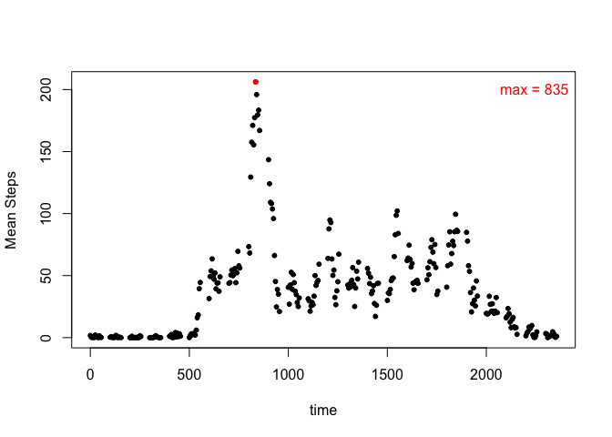

# Reproducible Research: Peer Assessment 1

```r
library(dplyr)
```

```
## 
## Attaching package: 'dplyr'
## 
## The following objects are masked from 'package:stats':
## 
##     filter, lag
## 
## The following objects are masked from 'package:base':
## 
##     intersect, setdiff, setequal, union
```

## Loading and preprocessing the data.
### Load using read.csv, convert date column to a "date" format, and group the data by dates using the dply package.
### The data is also grouped by the interval for the second part of the assignment.

```r
total.data <- read.csv("activity.csv", header = TRUE)
total.data$date <- as.Date(total.data$date)
total.date <- group_by(total.data, date)
total.interval <- group_by(total.data, interval)
```


## What is mean total number of steps taken per day?
### Histogram of steps taken per day.
### Steps are calculated as the sum total from each day, then the mean and median are calculated from the grouped data summary.

```r
sumsteps.date <- summarize(total.date, sum(steps))
sumsteps.mean <- mean(sumsteps.date$`sum(steps)`, na.rm = TRUE)
sumsteps.median <- median(sumsteps.date$`sum(steps)`, na.rm = TRUE)
with(sumsteps.date, hist(`sum(steps)`, n = 10, xlab = "Total Steps Taken per Day") )
abline(v = sumsteps.mean, col = "red")
abline(v = sumsteps.median, col = "blue")
legend("topright", legend = c(sprintf("mean = %.3f", sumsteps.mean), c(sprintf("median = %.3f", sumsteps.median))), text.col = c("red", "blue"), bty = "n")
```

 


## What is the average daily activity pattern?
### Summarize by interval and calcualte mean steps

```r
meansteps.interval <- summarize(total.interval, mean(steps, na.rm = TRUE))
plot(meansteps.interval, pch = 20, xlab = "time", ylab = "Mean Steps")
meansteps.max <- filter(meansteps.interval, `mean(steps, na.rm = TRUE)` == max(meansteps.interval$`mean(steps, na.rm = TRUE)`))
points(meansteps.max, col = "red", pch = 20)
legend("topright", text.col = "red", legend = sprintf("max = %.0f", meansteps.max$interval), bty = "n")
```

 


## Imputing missing values
### Input the missing values by taking the values for the mean of each interval

```r
print(sum(is.na(total.data)))
```

```
## [1] 2304
```

```r
narm.data <- total.data %>% group_by(interval) %>% mutate(steps = ifelse(is.na(steps), mean(steps, na.rm = TRUE), steps)) %>% ungroup

narm.date <- narm.data %>% group_by(date)
```
### Redo table with na's removed

```r
sumstepsn.date <- summarize(narm.date, sum(steps))
sumstepsn.mean <- mean(sumstepsn.date$`sum(steps)`, na.rm = TRUE)
sumstepsn.median <- median(sumstepsn.date$`sum(steps)`, na.rm = TRUE)
with(sumstepsn.date, hist(`sum(steps)`, n = 10, xlab = "Total Steps Taken per Day") )
abline(v = sumstepsn.mean, col = "red")
abline(v = sumstepsn.median, col = "blue")
legend("topright", legend = c(sprintf("mean = %.3f", sumstepsn.mean), c(sprintf("median = %.3f", sumstepsn.median))), text.col = c("red", "blue"), bty = "n")
```

 

## Are there differences in activity patterns between weekdays and weekends?
### Add weekday data to the data frame and group by weekday.
### Filter was used to calculate the mean number of steps for each interval for the weekday and weekend set.
### The data was plotted on 2 panels usint the base plot package.

```r
total.wkday <- total.data %>% mutate(weekday = weekdays(date)) %>% group_by(weekday)

meansteps.week <- total.wkday %>% filter(weekday == "Monday" | weekday == "Tuesday" | weekday == "Wednesday" | weekday == "Thursday" | weekday == "Friday") %>% group_by(interval) %>% summarize(mean(steps, na.rm = TRUE))

meansteps.end <- total.wkday %>% filter(weekday == "Saturday" | weekday == "Sunday") %>% group_by(interval) %>% summarize(mean(steps, na.rm = TRUE))

par(mfrow = c(2,1), mar = c(4,4,2,1))
plot(meansteps.week, type = "l", xlab = "time", ylab = "Mean Steps", main = "Weekday Steps")
plot(meansteps.end, type = "l", xlab = "time", ylab = "Mean Steps", main = "Weekend Steps")
```

 
